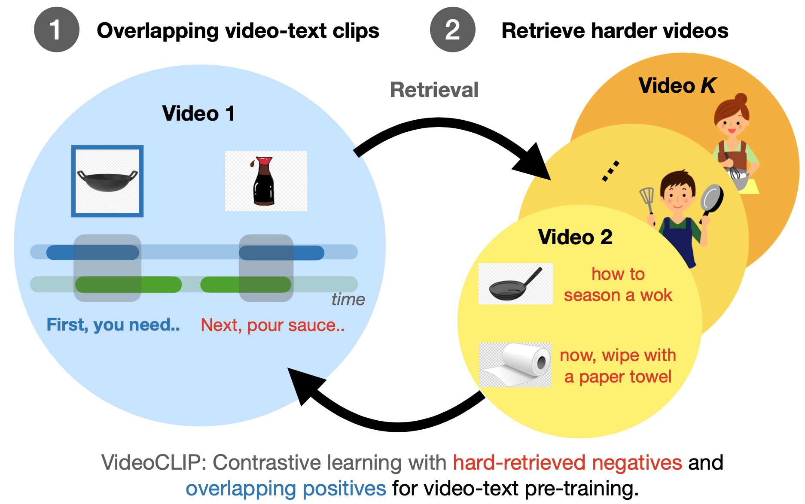

# VideoCLIP and VLM

You just find this toolkit for multimodal video understanding! It contains implementation of two recent multi-modal video understanding papers [VideoCLIP](https://arxiv.org/pdf/2109.14084.pdf) (EMNLP, 2021) and [VLM](https://aclanthology.org/2021.findings-acl.370.pdf) (ACL Findings, 2021), along with high-performance toolkits that are typically lacking in existing codebase. The toolkit is desigend to contain generic performance-tuned components that can be potentially adapted to other frameworks (we initially use fairseq). 

VideoCLIP is a contrastive learning model for zero-shot transfer to retrieval/classification/sequence labeling style tasks.



VLM is a masked language model style pre-training using only one encoder with masked modality model (MMM) for retrieval/generation/sequence labeling style tasks.


### News
[Oct. 2021] Initial release of implementation for the following papers:  
[VideoCLIP: Contrastive Pre-training for Zero-shot Video-Text Understanding](https://arxiv.org/pdf/2109.14084.pdf) (Xu et. al., EMNLP 2021)  
[VLM: Task-agnostic Video-Language Model Pre-training for Video Understanding](https://aclanthology.org/2021.findings-acl.370.pdf) (Xu et. al., ACL Findings 2021)  


### Installation
We aim to minimize the dependency of this repo on other packages.  
We use fairseq as the main trainer (no models/datasets dependency on fairseq. We will support other trainer in future):  
```
git clone https://github.com/pytorch/fairseq
cd fairseq
pip install -e .  # also optionally follow fairseq README for apex installation for fp16 training.
export MKL_THREADING_LAYER=GNU  # fairseq may need this for numpy.
```

Then install this toolkit:
```
cd examples/MMPT  # MMPT can be in any folder, not necessarily under fairseq/examples.
pip install -e .
```

The code is developed under Python=3.8.8, Pytorch=1.8, cuda=11.0 with fairseq=1.0.0a0+af0389f and tested under Python=3.8.8 pytorch=1.9 cuda=11.0 fairseq=1.0.0a0+8e7bc73 during code release.
Most models require `transformers==3.4` for API compatibility `pip install transformers==3.4`. 
In addition, some downstream tasks may need `conda install pandas`.  


### Usage
#### Download Checkpoints
We use pre-trained [S3D](https://github.com/antoine77340/S3D_HowTo100M) for video feature extraction. Please place the models as `pretrained_models/s3d_dict.npy` and `pretrained_models/s3d_howto100m.pth`.

Download VideoCLIP checkpoint `https://dl.fbaipublicfiles.com/MMPT/retri/videoclip/checkpoint_best.pt` to `runs/retri/videoclip` or VLM checkpoint `https://dl.fbaipublicfiles.com/MMPT/mtm/vlm/checkpoint_best.pt` to `runs/mtm/vlm`.

#### Demo of Inference
run `python locallaunch.py projects/retri/videoclip.yaml --dryrun` to get all `.yaml`s for VideoCLIP.

```python
import torch

from mmpt.models import MMPTModel


model, tokenizer, aligner = MMPTModel.from_pretrained(
    "projects/retri/videoclip/how2.yaml")

model.eval()


# B, T, FPS, H, W, C (VideoCLIP is trained on 30 fps of s3d)
video_frames = torch.randn(1, 2, 30, 224, 224, 3)
caps, cmasks = aligner._build_text_seq(
    tokenizer("some text", add_special_tokens=False)["input_ids"]
)

caps, cmasks = caps[None, :], cmasks[None, :]  # bsz=1

with torch.no_grad():
    output = model(video_frames, caps, cmasks, return_score=True)
print(output["score"])  # dot-product
```

#### Data Preparation
See [dataset](DATASET.md) for each dataset.

#### Global Config for Training Pipeline
We organize a global config file for a training/testing pipeline under projects (see a detailed [explanation](CONFIG.md)). For example, VideoCLIP in `projects/retri/videoclip.yaml` and VLM is in `projects/mtm/vlm.yaml`.

We wrap all cmds into `locallaunch.py` and `mmpt_cli/localjob.py`. You can check concrete cmds by `--dryrun` and then drop it for actual run.  

First, run `python locallaunch.py projects/retri/videoclip.yaml --dryrun` will generate configs for all configs of pre-training, zero-shot evaluation, fine-tuning and testing, for VideoCLIP under `projects/retri/videoclip`.  

Then each (either training or evaluation) process will be configed by a concrete config file (we save all complex arguments into the concrete config file for reproducibility, including fairseq args). For example, run zero-shot evaluation on youcook,
```
python locallaunch.py projects/retri/videoclip/test_youcook_zs.yaml --jobtype local_predict  # zero-shot evaluation.
python locallaunch.py projects/retri/videoclip/youcook_videoclip.yaml --jobtype local_single --dryrun  # fine-tuning: use --dryrun to check cmds and drop it to make an actual run; local_small will run on two gpus (as in paper).
python locallaunch.py projects/retri/videoclip/test_youcook_videoclip.yaml --jobtype local_predict  # testing on fine-tuned model.
```

Pretraining can be run as:  
```
python locallaunch.py projects/retri/videoclip/how2.yaml --jobtype local_single --dryrun # check then drop dryrun; paper is ran on local_big as 8 gpus.
```
You may need to change `--jobtype`, check/extend `LocalJob` in `mmpt_cli/localjob.py` for multi-gpu/multi-node pre-training.

The detailed instructions of pretraining and fine-tuning can be found at [pretraining instruction](pretraining.md) and [finetuning instruction](endtask.md).


### Development
Several components of this toolkit can be re-used for future research (and also our ongoing research).

#### Framework Wrapper
We currently only support fairseq, but most components can be easily fit into other frameworks like huggingface. This repo is a `--user-dir` of fairseq with fairseq wrapper. For example, `mmpt/tasks` includes a `FairseqMMTTask`, which manages `mmpt/datasets` with `FairseqDataset`, `mmpt/models` with `FairseqModel`, `mmpt/losses` with `FairseqCriterion`.  

#### Processors
**Multi**modal research introduces the complexity on modality alignment from different input sources to losses. Inspired by [MMF](https://github.com/facebookresearch/mmf), this toolkit leverages `mmpt/processors` to handle various needs of data preprocessing and loading, **alleviating** the needs of multiple `torch.data.utils.Dataset` (that can be tricky for ablation study).  
Processors can also be decoupled from `torch.data.utils.Dataset` for offline preprocessing instead of on-the-fly data preprocessing.

We decouple a `mmpt.MMDataset` as 3 types of processors: `MetaProcessor`, `VideoProcessor`, `TextProcessor` and `Aligner`. They can be configed in `dataset` field of a config file (e.g., see `projects/task/how2.yaml`).  
`MetaProcessor` is used to load the meta data about a dataset, aka, all video_ids of how2 dataset.  
`VideoProcessor` is used to load the video features about a dataset. For example, S3D features for each second of a video.  
`TextProcessor` is used to load the text (feature). For example, BERT pre-tokenized text clips for how2 dataset (with `start`s, `end`s of timestamps and `cap` for `token_ids`).  
`Aligner` is the core class for different baselines that prepares the training data. For example, sampling a clip, masking tokens for MLM, etc.

#### Performance-tuned Components
To speed up pre-training, this toolkit uses sharded features stored in mmaped numpy, backed by `ShardedTensor` in `mmpt/utils/shardedtensor.py` (adopted from MARGE paper). This reduces the loads of IO for multi-GPU training without loading all features for a video into the memory each time and `ShardedTensor` ensure features are stored in continuous disk space for near random access. This is used for both How2 video features and texts in `mmpt/processors/how2processor.py`.


### Citation
If this codebase is useful for your work, please cite the following papers:

```BibTeX
@inproceedings{xu-etal-2021-videoclip,
    title = "{VideoCLIP}: Contrastive Pre-training for\\Zero-shot Video-Text Understanding",
    author = "Xu, Hu  and
      Ghosh, Gargi  and
      Huang, Po-Yao  and
      Okhonko, Dmytro  and
      Aghajanyan, Armen  and
      Metze, Florian  and
      Zettlemoyer, Luke  and
      Feichtenhofer, Christoph",
    booktitle = "Proceedings of the 2021 Conference on Empirical Methods in Natural Language Processing (EMNLP)",
    month = nov,
    year = "2021",
    address = "Online",
    publisher = "Association for Computational Linguistics",
}

@inproceedings{xu-etal-2021-vlm,
    title = "{VLM}: Task-agnostic Video-Language Model Pre-training for Video Understanding",
    author = "Xu, Hu  and
      Ghosh, Gargi  and
      Huang, Po-Yao  and
      Arora, Prahal  and
      Aminzadeh, Masoumeh  and
      Feichtenhofer, Christoph  and
      Metze, Florian  and
      Zettlemoyer, Luke",
    booktitle = "Findings of the Association for Computational Linguistics: ACL-IJCNLP 2021",
    month = aug,
    year = "2021",
    address = "Online",
    publisher = "Association for Computational Linguistics",
    url = "https://aclanthology.org/2021.findings-acl.370",
    doi = "10.18653/v1/2021.findings-acl.370",
    pages = "4227--4239",
}
```

### Bug Reports
This repo is in its initial stage, welcome bug reports to huxu@fb.com

### Copyright
The majority of Multimodal Pre-training (MMPT) is licensed under CC-BY-NC, however portions of the project are available under separate license terms: Evaluation Codes/Models: Howto100M and HuggingFace Transformers are licensed under the Apache2.0 license; COIN and NLG-eval are licensed under the MIT license; CrossTask is licensed under the BSD-3; DiDeMo is licensed under the BSD-2 license.
