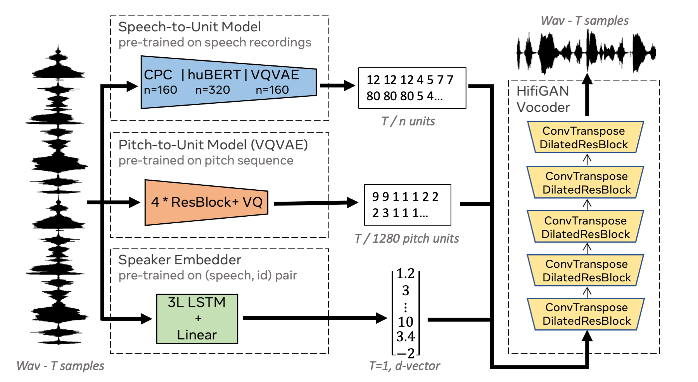

# Speech Resynthesis from Discrete Disentangled Self-Supervised Representations
Landing page with usfull resources for the [Speech Resynthesis from Discrete Disentangled Self-Supervised Representations](https://arxiv.org/abs/2104.00355) paper.

<p align="center"></p>

__Abstract__: We propose using self-supervised discrete representations for the task of speech resynthesis. To generate disentangled representation, we separately extract low-bitrate representations for speech content, prosodic information, and speaker identity. This allows to synthesize speech in a controllable manner. We analyze various state-of-the-art, self-supervised representation learning methods and shed light on the advantages of each method while considering reconstruction quality and disentanglement properties. Specifically, we evaluate the F0 reconstruction, speaker identification performance (for both resynthesis and voice conversion), recordings' intelligibility, and overall quality using subjective human evaluation. Lastly, we demonstrate how these representations can be used for an ultra-lightweight speech codec. Using the obtained representations, we can get to a rate of 365 bits per second while providing better speech quality than the baseline methods.


## Quick Links
- [Paper](https://arxiv.org/pdf/2104.00355.pdf)
- [Samples](https://speechbot.github.io/resynthesis/index.html)
- [Code](https://github.com/facebookresearch/speech-resynthesis)

The codebase for the [Speech Resynthesis from Discrete Disentangled Self-Supervised Representations](https://arxiv.org/abs/2104.00355) paper can be found under the following [repository](https://github.com/facebookresearch/speech-resynthesis). 


## Citation
```
@inproceedings{polyak21_interspeech,
  author={Adam Polyak and Yossi Adi and Jade Copet and 
          Eugene Kharitonov and Kushal Lakhotia and 
          Wei-Ning Hsu and Abdelrahman Mohamed and Emmanuel Dupoux},
  title={{Speech Resynthesis from Discrete Disentangled Self-Supervised Representations}},
  year=2021,
  booktitle={Proc. Interspeech 2021},
}
``` 
